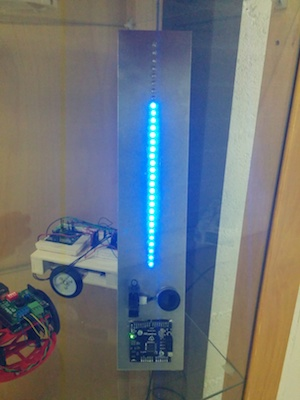

# PRismeLedDriver

This sketch is for the LED driver project that uses a large IR sensor to detect an obstacle and light up a series of 32 LEDs.

The LEDs are controlled by two [TLC5925I](http://www.ti.com/lit/ds/symlink/tlc5925.pdf) 16-channel LED drivers, see the connection schema on the board itself or in the code.

The light intensity is managed by the PWM signal, the intensity is low when no obstacle is detected and grows when an obstacle approaches.

The IR module output isn't very stable so an average of 10 readings is used. The speaker is not used.